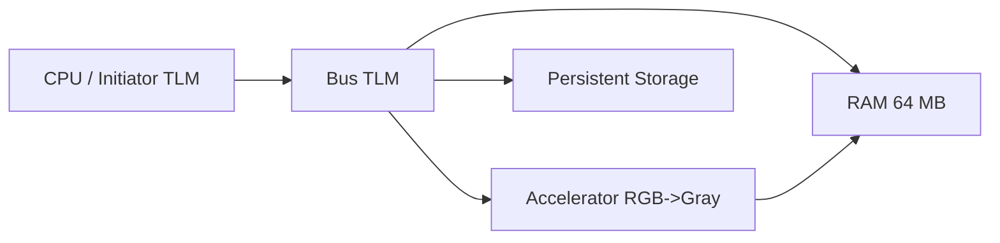
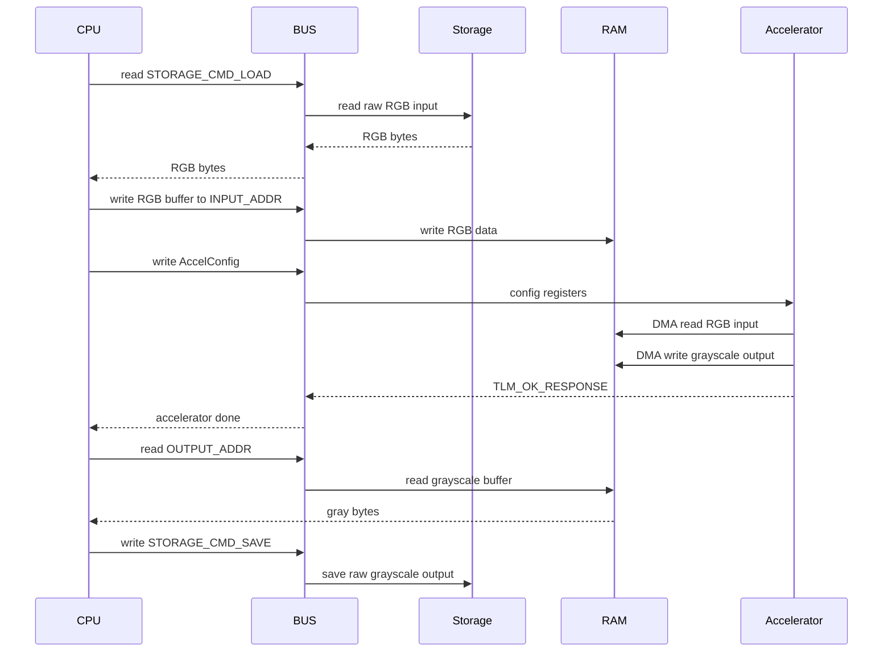

# systemc-tlm-rgb2gray-platform

Plataforma SystemC/TLM para convertir una imagen RGB a escala de grises
mediante un procesador, un bus, una RAM, un acelerador y almacenamiento
persistente modelados como módulos TLM.

## Contenido del repositorio

- `src/main.cpp`: punto de entrada `sc_main` del modelo SystemC
- `src/cpu.h`: módulo CPU que orquesta el flujo completo
- `src/bus.h`: router TLM por direcciones
- `src/ram.h`: memoria RAM de 64 MB con dos puertos
- `src/accelerator.h`: acelerador RGB a grayscale
- `src/persistent_storage.h`: periférico de almacenamiento persistente
- `src/memory_map.h`: mapa de memoria, tamaños y constantes
- `scripts/image_to_raw.py`: convierte JPG/PNG a raw RGB
- `scripts/raw_to_image.py`: convierte raw a PNG/JPG
- `pictures/jpg/`: imágenes de entrada de ejemplo
- `pictures/raw/`: archivos raw de ejemplo

## Requisitos

### Dependencias de sistema

En Ubuntu o Debian:

```bash
sudo apt update
sudo apt install -y build-essential cmake make wget tar
```

### Pillow

Los scripts de conversión de imágenes usan Pillow:

```bash
python3 -m pip install pillow
```

### SystemC

Si no tienes SystemC instalado, compílalo desde la fuente y luego apunta este
proyecto a esa instalación.

Ejemplo en Ubuntu/Debian:

```bash
cd /tmp
mkdir systemc-source
cd systemc-source
wget https://github.com/accellera-official/systemc/archive/refs/tags/3.0.2.tar.gz
tar -xf 3.0.2.tar.gz
cd systemc-3.0.2/
../configure --prefix=/opt/systemc
make -j"$(nproc)"
sudo make install
```

## Compilación

### Compilación con CMake

```bash
make native-build SYSTEMC_HOME=/opt/systemc
```

Si tu instalación de SystemC está en otra ruta, cambia `SYSTEMC_HOME`:

```bash
make native-build SYSTEMC_HOME=/ruta/a/systemc
```

### Ejecutar el binario nativo

```bash
make native-run SYSTEMC_HOME=/opt/systemc
```

Por defecto el binario usa:

- entrada: `pictures/raw/grumpy-online.raw`
- salida: `build/native-output.raw`

## Conversión de imagen

### Convertir una imagen a raw RGB

```bash
python3 scripts/image_to_raw.py pictures/jpg/grumpy-cat.jpg build/proc_input.raw --resize
```

### Convertir el raw de salida a PNG

```bash
python3 scripts/raw_to_image.py build/output.raw build/output.png --mode gray
```

## Organización del módulo

- `CPU`: inicia la secuencia leyendo el raw de entrada, copiándolo a RAM,
  activando el acelerador y almacenando el resultado.
- `Bus`: enruta transacciones hacia RAM, acelerador o almacenamiento según la
  dirección física.
- `RAM`: modela 64 MB de memoria compartida, accesible por CPU y DMA.
- `Accelerator`: lee RGB desde RAM por DMA, convierte cada píxel a
  grayscale y escribe el resultado de vuelta en RAM.
- `PersistentStorage`: carga el archivo raw de entrada y guarda el raw de
  salida.

## Marco Teorico

### Diagrama de bloques de la arquitectura propuesta



### Diagrama de secuencias



### Formato de las transacciones

Todas las interacciones usan `tlm::tlm_generic_payload` con `b_transport`.

| Campo | Uso |
|---|---|
| `command` | `TLM_READ_COMMAND` o `TLM_WRITE_COMMAND` |
| `address` | Dirección física o desplazamiento local, según el módulo |
| `data_ptr` | Buffer de entrada o salida |
| `data_length` | Tamaño en bytes del buffer |
| `streaming_width` | Igual a `data_length` para transferencias lineales |
| `byte_enable_ptr` | `nullptr` |
| `dmi_allowed` | `false` |
| `response_status` | `TLM_INCOMPLETE_RESPONSE` al inicio, luego `TLM_OK_RESPONSE` o error |

### Secuencia de transacciones del CPU

1. Lee `RGB_SIZE` bytes desde `STORAGE_BASE + STORAGE_CMD_LOAD`.
2. Escribe el buffer RGB en `INPUT_ADDR`.
3. Escribe `AccelConfig` en `ACCEL_BASE`.
4. Lee `GRAY_SIZE` bytes desde `OUTPUT_ADDR`.
5. Guarda el resultado en `STORAGE_BASE + STORAGE_CMD_SAVE`.

### Mapa de memoria utilizado

| Región | Base | Tamaño | Uso |
|---|---:|---:|---|
| RAM | `0x0000_0000` | `64 MB` | memoria compartida CPU/DMA |
| Acelerador | `0x1000_0000` | `256 B` | registros de configuración |
| Almacenamiento | `0x2000_0000` | `0x1000` | comandos de carga/guardado |

Constantes principales:

| Constante | Valor |
|---|---:|
| `IMG_WIDTH` | `1920` |
| `IMG_HEIGHT` | `1080` |
| `NUM_PIXELS` | `2,073,600` |
| `RGB_SIZE` | `6,220,800` bytes |
| `GRAY_SIZE` | `2,073,600` bytes |
| `INPUT_ADDR` | `0x0000_0000` |
| `OUTPUT_ADDR` | `0x0060_0000` |

### Resultados obtenidos

Con una imagen RGB de 1080p:

- la entrada debe tener exactamente `6,220,800` bytes
- la salida en escala de grises tiene `2,073,600` bytes
- el modelo conserva una latencia proporcional a:
  - lectura desde almacenamiento: `STORAGE_NS_PER_BYTE`
  - acceso a RAM: `RAM_NS_PER_BYTE`
  - procesamiento del acelerador: `ACCEL_NS_PER_PIXEL`

Además, el módulo `PersistentStorage` valida que el archivo de entrada sea
exactamente una imagen raw RGB de `1920 x 1080` píxeles antes de ejecutar la
simulación.

## Notas de uso

- El punto de entrada nativo lee un archivo raw RGB, no una imagen JPG/PNG
  directamente.
- El binario nativo se genera como `./rgb2gray` con la configuración actual de
  CMake.
- Si necesitas generar un raw de prueba, usa `scripts/image_to_raw.py` antes de
  ejecutar el binario.

## Objetivos de compilación

```bash
make native-build
make native-run
make image
```

## Disclaimer: Uso de Inteligencia Artificial
Este README fue co-creado con el uso de Inteligencia Artificial a partir de los requisitos de forma y fondo de los documentos del proyecto contemplando el texto y los diagramas. Toda la salida fue re validada y modificada segun fuera requerido para evitar condiciones de alucinaciones o perdida de obejtivos tipicos de los modelos generativos.
Damos fe que el contenido fue revisado por humanos y que cualquier error proviene tanto de la IA como de humanos

Prompts actualizados:
- Agrega un marco teorico que cumpla con el punto README del PDF adjunto.
